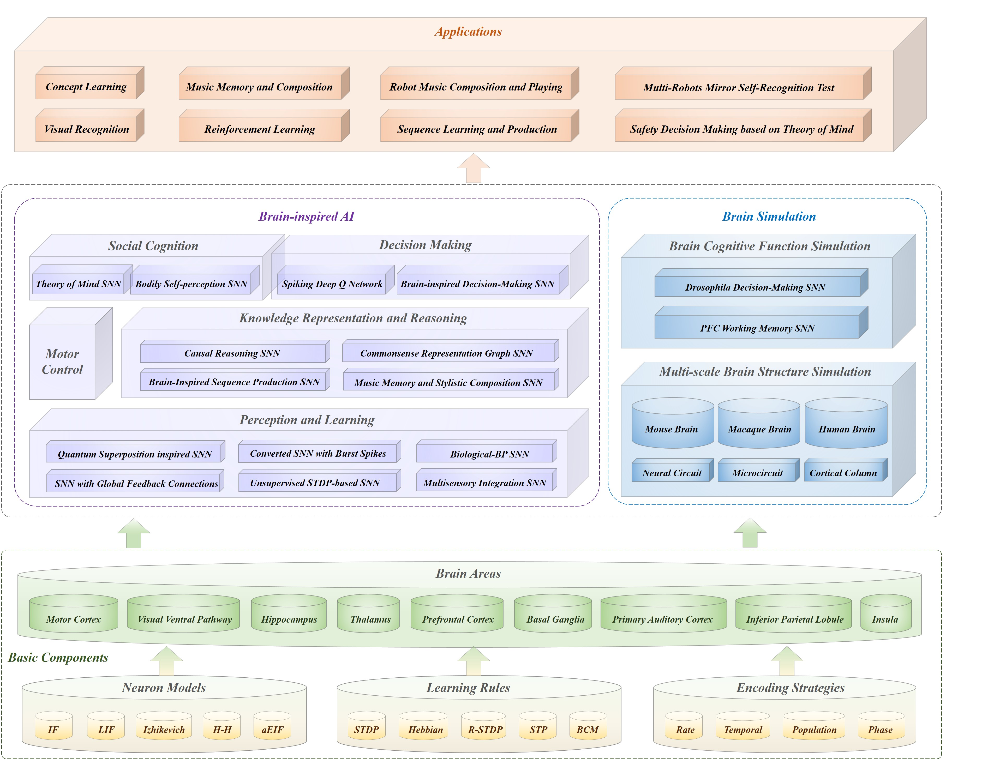

# BrainCog

BrainCog is an open source spiking neural network based brain-inspired 
cognitive intelligence engine for Brain-inspired Artificial Intelligence and brain simulation. More information on BrainCog can be found on its homepage http://www.brain-cog.network/


BrainCog provides essential and fundamental components to model biological and artificial intelligence.



## Brain-Inspired AI
BrainCog currently provides cognitive functions components that can be classified 
into five categories: 
* Perception and Learning
* Decision Making
* Motor Control
* Knowledge Representation and Reasoning
* Social Cognition


## Brain Simulation
BrainCog currently include two parts for brain simulation:
* Brain Cognitive Function Simulation
* Multi-scale Brain Structure Simulation


The anatomical and imaging data is used to support our simulation from various aspects. 

## Requirements:
* CUDA toolkit == 11.
* numpy >= 1.21.2
* scipy >= 1.8.0
* h5py >= 3.6.0
* torch >= 1.10
* torchvision >= 0.12.0
* torchaudio  >= 0.11.0
* timm >= 0.5.4
* matplotlib >= 3.5.1
* einops >= 0.4.1
* thop >= 0.0.31
* pyyaml >= 6.0
* loris >= 0.5.3
* pandas >= 1.4.2  
* tonic (special)
* pandas >= 1.4.2  
* xlrd == 1.2.0


## Install

```
# optional, if use datasets 
git clone https://github.com/FloyedShen/tonic.git
cd tonic 
pip install -e .

pip install -r requirements.txt

git clone https://github.com/BrainCog-X/Brain-Cog.git
cd BrainCog
pip install -e .
```

## Example 

1. Examples for Image Classification
```shell 
cd ./examples/Perception_and_Learning/img_cls/bp 
python main.py --model cifar_convnet --dataset cifar10 --node-type LIFNode --step 8 --device 0
```

2. Examples for Event Classification 

```shell
cd ./examples/Perception_and_Learning/img_cls/bp 
python main.py --model dvs_convnet --node-type LIFNode --dataset dvsc10 --step 10 --batch-size 128 --act-fun QGateGrad --device 0 
```

Other BrainCog features and tutorials can be found at http://www.brain-cog.network/docs/
