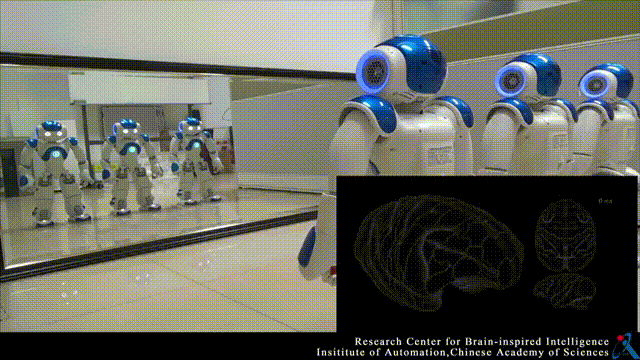
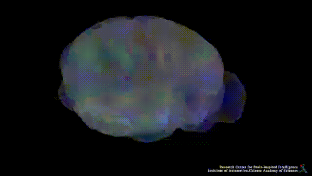

# braincog
BrainCog is an open source spiking neural network based brain-inspired 
cognitive intelligence engine for Brain-inspired Artificial Intelligence and brain simulation. More information on braincog can be found on its homepage http://www.brain-cog.network/

The current version of BrainCog contains at least 16 functional spiking neural network algorithms (including but not limited to perception and learning, decision making, knowledge representation and reasoning, motor control, social cognition, etc.) built based on BrainCog infrastructures, and BrainCog also provide brain simulations to drosophila, rodent, monkey, and human brains at multiple scales based on spiking neural networks at multiple scales. 

If you use braincog in your research, the following paper can be cited as the source for braincog.

Yi Zeng, Dongcheng Zhao, Feifei Zhao, Guobin Shen, Yiting Dong, Enmeng Lu, Qian Zhang, Yinqian Sun, Qian Liang, Yuxuan Zhao, Zhuoya Zhao, Hongjian Fang, Yuwei Wang, Yang Li, Xin Liu, Chengcheng Du, Qingqun Kong, Zizhe Ruan, Weida Bi. BrainCog: A Spiking Neural Network based Brain-inspired Cognitive Intelligence Engine for Brain-inspired AI and Brain Simulation. arXiv:2207.08533, 2022.
https://arxiv.org/abs/2207.08533


braincog provides essential and fundamental components to model biological and artificial intelligence.


## Brain-Inspired AI
braincog currently provides cognitive functions components that can be classified 
into five categories: 
* Perception and Learning
* Decision Making
* Motor Control
* Knowledge Representation and Reasoning
* Social Cognition




## Brain Simulation
braincog currently include two parts for brain simulation:
* Brain Cognitive Function Simulation
* Multi-scale Brain Structure Simulation


 


The anatomical and imaging data is used to support our simulation from various aspects. 

## Requirements:
* python == 3.8
* CUDA toolkit == 11.
* numpy >= 1.21.2
* scipy >= 1.8.0
* h5py >= 3.6.0
* torch >= 1.10
* torchvision >= 0.12.0
* torchaudio  >= 0.11.0
* timm >= 0.5.4
* matplotlib >= 3.5.1
* einops >= 0.4.1
* thop >= 0.0.31
* pyyaml >= 6.0
* loris >= 0.5.3
* pandas >= 1.4.2  
* tonic (special)
* pandas >= 1.4.2  
* xlrd == 1.2.0


## Install

```

# To install braincog
pip install braincog

or

git clone https://github.com/braincog-X/Brain-Cog.git
cd Brain-Cog
pip install -e .

or

pip install git+https://github.com/braincog-X/Brain-Cog.git


# optional, to use datasets 
git clone https://github.com/BrainCog-X/tonic_braincog.git
cd tonic_braincog
pip install -e .

or

pip install git+https://github.com/BrainCog-X/tonic_braincog.git

```

## Example 

1. Examples for Image Classification
```shell 
cd ./examples/Perception_and_Learning/img_cls/bp 
python main.py --model cifar_convnet --dataset cifar10 --node-type LIFNode --step 8 --device 0
```

2. Examples for Event Classification 

```shell
cd ./examples/Perception_and_Learning/img_cls/bp 
python main.py --model dvs_convnet --node-type LIFNode --dataset dvsc10 --step 10 --batch-size 128 --act-fun QGateGrad --device 0 
```

Other braincog features and tutorials can be found at http://www.brain-cog.network/docs/
