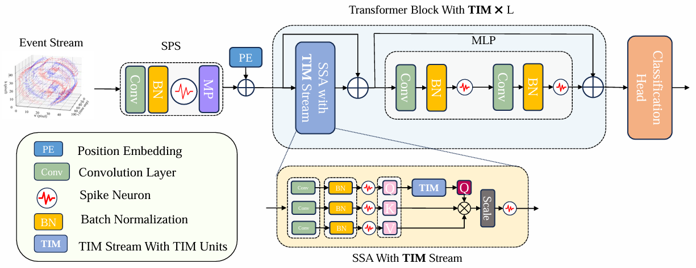

# TIM: An Efficient Temporal Interaction Module for Spiking Transformer, [IJCAI2024](https://arxiv.org/abs/2401.11687)



## Reference
```
@misc{shen2024tim,
      title={TIM: An Efficient Temporal Interaction Module for Spiking Transformer}, 
      author={Sicheng Shen and Dongcheng Zhao and Guobin Shen and Yi Zeng},
      year={2024},
      eprint={2401.11687},
      archivePrefix={arXiv},
      primaryClass={cs.NE}
}
```

Here is the official implemented code of TIM. The code is based on Pytorch and [Braincog](https://github.com/BrainCog-X/Brain-Cog)

## Requirements
### Create Braincog Virtual Environment
```
conda create -n braincog python=3.8
conda activate braincog
pip install braincog
```
### Dataset Preparation
**Datasets Needed**: CIFAR10-DVS, N-CALTECH101, UCF101DVS, NCARS, HMDB51DVS, SHD
Please unzip data to ```/data/datasets``` so that dataset.py may directly load corresponding dataset for training

## Model Training
For most DVS data, we prefer using the event-frame size of 64 but not 128 here.
Please adjust your hyper parameters here. 10 is set as the default value of time step numbers.
```
@register_model
def spikformer_dvs(pretrained=False, **kwargs):
    model = Spikformer(TIM_alpha=0.5,step=10,if_UCF=False,num_classes=10,
        # img_size_h=64, img_size_w=64,
        # patch_size=16, embed_dims=256, num_heads=16, mlp_ratios=4,
        # in_channels=2, qkv_bias=False,
        # depths=2, sr_ratios=1,
        **kwargs
    )
    model.default_cfg = _cfg()
    return model
```
### Training on CIFAR10-DVS
```
python main.py --model spikformer_dvs --dataset dvsc10 --epoch 500 --batch-size 16 --event-size 64 
```
### Training on N-CALTECH101
```num_classes``` should be set to 101
```
python main.py --model spikformer_dvs --dataset NCALTECH101 --epoch 500 --batch-size 16 --event-size 64  --num_classes 101
```

### Training on NCARS
```num_classes``` should be set to 2
```
python main.py --model spikformer_dvs --dataset NCARS --epoch 500 --batch-size 16 --event-size 64  --num_classes 2
```
### Training on UCF101DVS
```num_classes``` should be set to 101,```if_UCF``` should be set to ```True``` 
```
python main.py --model spikformer_dvs --dataset UCF101DVS --epoch 500 --batch-size 16 --event-size 64  --num_classes 101
```
### Training on HMDB51DVS
```num_classes``` should be set to 101,```if_UCF``` should be set to ```True``` 
```
python main.py --model spikformer_dvs --dataset HMDBDVS --epoch 500 --batch-size 16 --event-size 64  --num_classes 51
```

### Training on SHD
```num_classes``` should be set to 20
```
python main.py --model spikformer_shd --dataset SHD --epoch 500 --batch-size 16 --num_classes 20
```
