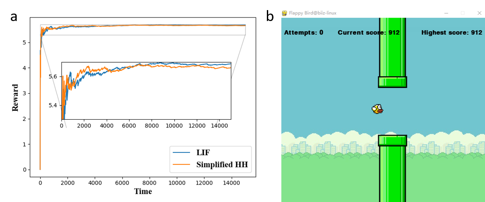

# Brain-inspired Decision-Making SNN

## Requirements

"decisionmaking.py", "BDM-SNN.py"，"BDM-SNN-hh.py"：pygame

"BDM-SNN-UAV.py"：robomaster


## Run
 The decisionmaking.py and BDM-SNN.py implements the core code of the brain-inspired decision-making spiking neural network in paper entitled "A brain-inspired decision-making spiking neural network and its application in unmanned aerial vehicle".

 "decisionmaking.py, BDM-SNN.py"  includes the multi-brain regions coordinated decision-making spiking neural network with LIF neurons.

 "BDM-SNN-hh.py"  includes the BDM-SNN with simplified HH neurons.

 "BDM-SNN-UAV.py"  includes the BDM-SNN applied to the UAV (DJI Tello talent), users need to define the reinforcement learning task.

```shell
python decisionmaking.py

python BDM-SNN.py

python BDM-SNN-hh.py

python BDM-SNN-UAV.py
```

## Results
"decisionmaking.py", "BDM-SNN.py"  and  "BDM-SNN-hh.py"  have been verified on Flappy Bird game. BDM-SNN could stably pass the pipeline on the first try.



Differences from the original article: an improved reward-modulated STDP learning rule.

## Citation

If you find this package helpful, please consider citing the following papers:

```BibTex
@article{zhao2018brain,
  title={A brain-inspired decision-making spiking neural network and its application in unmanned aerial vehicle},
  author={Zhao, Feifei and Zeng, Yi and Xu, Bo},
  journal={Frontiers in neurorobotics},
  volume={12},
  pages={56},
  year={2018},
  publisher={Frontiers Media SA}
}

@misc{https://doi.org/10.48550/arxiv.2207.08533,
  doi = {10.48550/ARXIV.2207.08533},
  url = {https://arxiv.org/abs/2207.08533},
  author = {Zeng, Yi and Zhao, Dongcheng and Zhao, Feifei and Shen, Guobin and Dong, Yiting and Lu, Enmeng and Zhang, Qian and Sun, Yinqian and Liang, Qian and Zhao, Yuxuan and Zhao, Zhuoya and Fang, Hongjian and Wang, Yuwei and Li, Yang and Liu, Xin and Du, Chengcheng and Kong, Qingqun and Ruan, Zizhe and Bi, Weida},
  title = {BrainCog: A Spiking Neural Network based Brain-inspired Cognitive Intelligence Engine for Brain-inspired AI and Brain Simulation},
  publisher = {arXiv},
  year = {2022},
}

```
