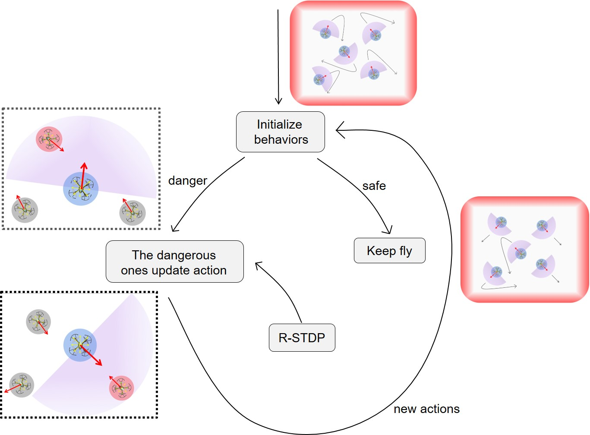

# Reward-modulated Spiking Neural Network for Self-organizing Collision Avoidance of Drone Swarm

This repository contains code from our paper [*Nature-inspired Self-organizing Collision Avoidance for Drones Swarm Based on Reward-modulated Spiking Neural Network*] published in Cell Patterns. 
https://www.cell.com/patterns/fulltext/S2666-3899(22)00236-7

We also provide the BrainCog-based version: https://github.com/BrainCog-X/Brain-Cog/tree/main/examples/decision_making/swarm

If you use our code or refer to this project, please cite this paper:
Feifei Zhao,Yi Zeng, Bing Han, Hongjian Fang, and Zhuoya Zhao. Nature-inspired Self-organizing Collision Avoidance for Drones Swarm Based on Reward-modulated Spiking Neural Network. Patterns, DOI：https://doi.org/10.1016/j.patter.2022.100611

## Paper Introduction 
The collaborative interaction mechanisms of biological swarms in nature are of great importance to inspire the study of swarm intelligence. This paper proposed a self-organizing obstacle avoidance model by drawing on the decentralized, self-organizing properties of intelligent behavior of biological swarms. Each individual independently adopts brain-inspired reward-modulated spiking neural network (RSNN) to achieve online learning and makes decentralized decisions based on local observations. The following picture shows the decision-making process of our model.

We validated the proposed model on swarm collision avoidance tasks (a swarm of unmanned aerial vehicles without central control) in a bounded space, carrying out simulation and real-world experiments. The drone swarm emerges with safe flight behavior, as shown in the following videos. Compared with artificial neural network-based online learning methods, our proposed method exhibits superior performance and better stability. 

## Run
 * "reward-modulated snn on swarm collision avoidance.py"  includes the self-organized collision avoidance implemented by RSNN for simulation scenarios.
 * "flytestfive.py"  includes five UAVs swarm collision avoidance validation in real bounded scenario.
 
 ## Requirments
* "reward-modulated snn on swarm collision avoidance.py": python==3.7, numpy>=1.21.6
* "flytestfive.py": multi_robomaster

